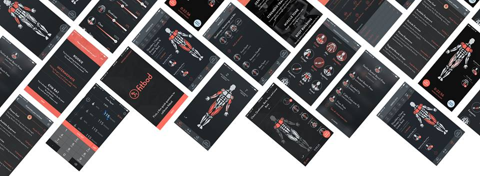

# fitbod-predict-max-weight
ML model for predicting maximum weight used in Barbell Bench Press exercise 

### Dataset
  - The dataset is provided by Fidbod company
  - `1_data/fitbod_AHORTIANGTHAM_20191031-184801.csv`

### Model (first iteration)
  - built Random Forest model and compare to Linear regression

### Result
  - the evaluation metrics used are MSE and R^2.
   
### Notebook 
  - `Fitbod_HW_AHORTIANGTHAM.ipynb`

### Presentation
  - https://drive.google.com/open?id=1ho9BI3H2eiTzDJPJifIPbvHb_waRfr1p

